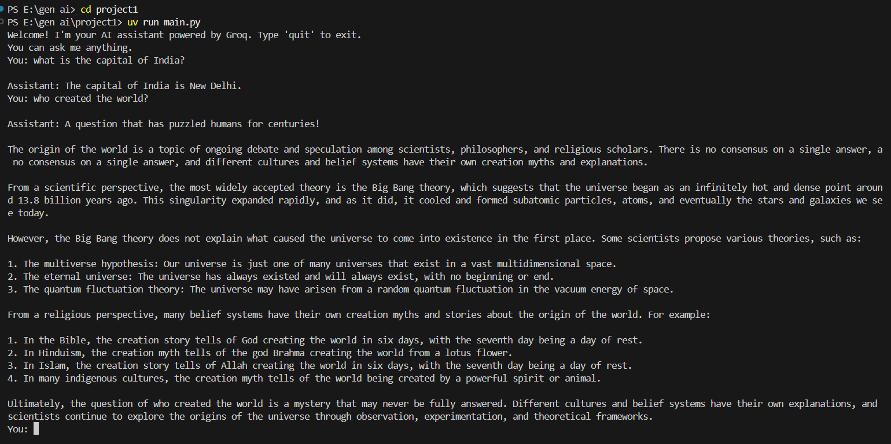

# 🧠 LangChain Groq AI Assistant

This project is a conversational AI assistant powered by [LangChain](https://www.langchain.com/), [Groq](https://groq.com/), and LLaMA3. It uses a custom arithmetic tool and a streaming response model to answer questions in real-time, similar to a ChatGPT-like experience — but locally built with Python.

---

## ⚙️ Features

- Uses Groq’s `llama3-8b-8192` model for intelligent conversation.
- Includes a custom calculator tool via LangChain’s `@tool` decorator.
- Handles complex and open-ended questions with natural language responses.
- Streams output as it is generated (like ChatGPT).
- Environment variables managed securely with `.env`.

---

## 🖥️ Sample Interaction

Here is an example interaction from the terminal:

> **You:** What is the capital of India?  
> **Assistant:** The capital of India is New Delhi.  
> **You:** Who created the world?  
> **Assistant:** (detailed answer combining scientific and religious theories)




---

## 🏁 Getting Started

### 1. Clone this repository:

```bash
git clone https://github.com/your-username/langchain-groq-agent.git
cd langchain-groq-agent
